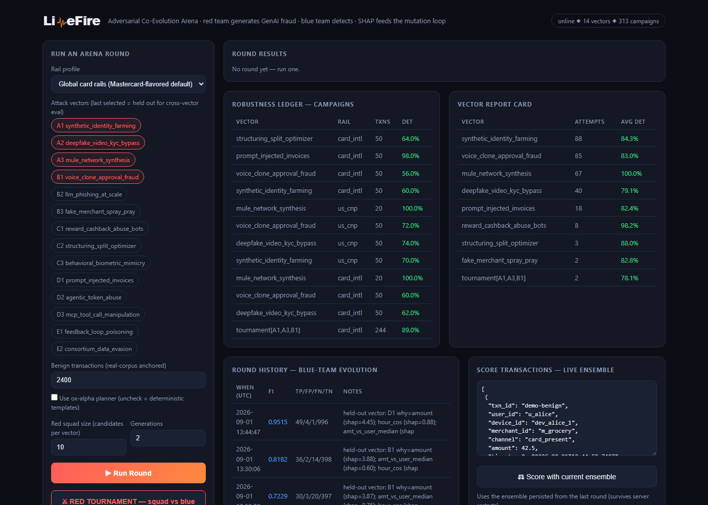
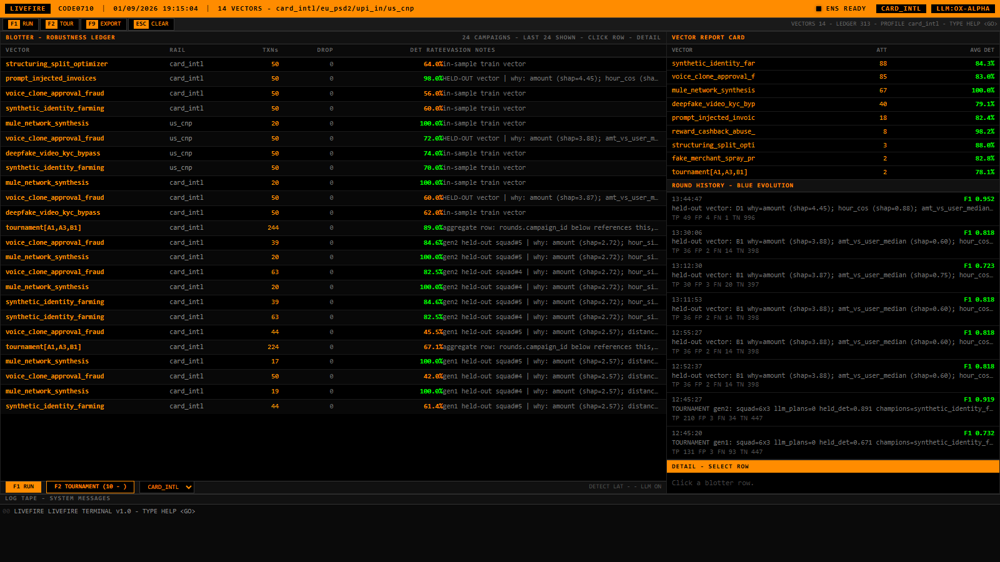

<div align="center">

<picture>
  <source media="(prefers-color-scheme: dark)" srcset="app/static/logo-dark.svg">
  
</picture>

**An adversarial co-evolution arena for payment-fraud defense.**
Red invents attacks → Blue learns to catch them → SHAP explains why → every round hits a Robustness Ledger.

Mastercard Innovation Challenge 2026 — AI Defense Lab for Payment Security · **Team code0710**

[](https://www.python.org/)
[](https://fastapi.tiangolo.com/)
[](https://react.dev/)
[](livefire/tests/test_e2e.py)
[](attacks/taxonomy.json)
[](config/rail_profiles.py)

[Why LiveFire](#why-livefire-exists) · [Screenshots](#screenshots) · [Quick Start](#quick-start) · [Architecture](#architecture) · [Honest Numbers](#honest-numbers--read-before-you-quote) · [Mastercard Fit](#where-this-sits-in-a-real-mastercard-transaction) · [Reproduce It](#evidence--reproducibility)

</div>

---

## Why LiveFire exists

Static fraud models lose to adaptive attackers. LiveFire closes the loop: an **LLM red team proposes statistical generator parameters** → a **deterministic weaver compiles them into rail-realistic transactions** → a **heterogeneous blue ensemble detects + disagrees → novelty-flags** → **SHAP explains what got caught** → that intelligence **mutates the next attack generation**. Same vectors replayed across four global rail profiles for a per-rail survival comparison — the one axis none of the reference architectures we benchmarked against attempt.

| Usual failure | What LiveFire does instead |
|---|---|
| Metrics trained and tested on its own simulator | **Two numbers, never mixed.** Real credibility = XGB on real ULB holdout (ROC-AUC 0.9852 / AP 0.8750). Arena = synthetic-attack detection vs real-anchored benign. |
| Single model, single threshold, inflated detection rate | **Heterogeneous blue**: XGB (explainable) + LR + deterministic rules + IF (benign-only). Threshold calibrated on a **held-out benign slice** at a 0.5% FP target. |
| "98% detection" at an unstated false-positive rate | **Honest operating point.** Every run reports its own *measured* detection + *realized* FP next to the 0.5% target. Ranges across seeds, not cherry-picked points. |
| LLM writes fraudulent transactions directly | **LLM buys the plan, the Weaver builds the transactions.** The LLM only outputs statistical parameters; a seeded CPU compiler expands them through a 6-check constraint engine per rail. |
| One geography, one rail | **Four rail profiles** — `card_intl` / `eu_psd2` / `us_cnp` / `upi_in` — same vectors, per-rail survival in one ledger. |
| A "prompt-injection detector" that's a keyword match | **Category D is a structural check.** `beneficiary_mismatch` compares the payment mandate's stated payee against where settlement actually lands — the same account-reference-binding principle real agentic-payment protocols use. |

## Screenshots

<table>
<tr><td align="center"><b>Dashboard</b> — <code>localhost:8000</code></td></tr>
<tr><td></td></tr>
<tr><td align="center"><b>LiveFire Terminal</b> — <code>localhost:3000</code>, React/Vite/Tailwind, amber-on-black</td></tr>
<tr><td></td></tr>
</table>

Both surfaces talk to the same live API and the same running ensemble — the terminal isn't a mockup, it's a second client.

## Quick Start

```bash
python -m venv .venv && .venv\Scripts\activate
pip install -r requirements.txt
copy config\settings.example.env .env   # fill LLM_API_KEY for live red-team generation; product runs without it

# 1 — real-data anchor (separate from arena, no synthetic)
python defense\train_real_backbone.py        # → defense/models/artifacts/ulb_backbone.joblib

# 2 — full test suite, zero LLM, deterministic
python tests\test_e2e.py                    # 6/6

# 3 — the API + dashboard
uvicorn app.api:app --port 8000             # http://localhost:8000  (or: docker compose up --build)

# 4 — the terminal UI (optional second surface; talks to the same API on :8000)
cd app\frontend && npm install && npm run dev   # http://localhost:3000
```

`POST /api/round` runs one closed loop. `POST /api/tournament` runs population red-teaming. `POST /api/detect` scores your own transactions. `GET /api/ledger/export` downloads the ledger.

## Architecture

```
IDENTIFY  14-vector taxonomy (5 families incl. agentic D1-D3) — atlas of further-researched
          vectors tracked for the next iteration, not padded into the shipped count
GENERATE  ox-alpha-lineage model (reasoning=max, failover chains) → generator params (JSON, not free-text)
WEAVE     Transaction Weaver → seeded, constraint-checked txns (CPU, reproducible)
DEFEND    XGB (50%) + LR (20%) + Rules (20%) + IsolationForest (10%) → fused score, calibrated threshold
EXPLAIN   SHAP TreeExplainer → top-k reasons → written to strategy memory (SQLite)
MUTATE    memory + SHAP context fed into next red prompt → co-evolution
LEDGER    every campaign + round persisted; multi-rail replay; CSV export
```

**Red:** an ox-alpha-lineage model via `attacks/redagent/core/llm_client.py` — tiered routing, failover chains on both `429` (rate limit) and `404` (a retired/renamed model slug — OpenRouter's free/preview tier churns these; the whole point of a chain is to survive exactly that), fence-strip, shared `AsyncClient` scoped correctly per event loop.

**Weaver:** `weave_attack_plan()` validates → entity pools → amount ladder + jitter → inter-arrivals → tz-aware timestamps → per-txn constraint engine (C1-C6) × rail profile. Seeded → reproducible.

**Blue:** `defense/features/arena_features.py` → 17 dims: behavioral, velocity (causal 1h), graph (causal fan-out), `memo_injection_score` (text-pattern tier) + `beneficiary_mismatch` (structural tier, Category D). `defense/models/backbone.py` fusion `0.50/0.20/0.20/0.10`; disagreement → `novelty_flag`; `beneficiary_mismatch` also fires as a hard, fully-auditable rule — a mandate/settlement mismatch is fraud by construction, not a probabilistic call.

**Memory & Ledger:** `strategy_memory.py` (SQLite, WAL mode, foreign keys enforced) — campaigns + rounds, vector report cards, mutation context. `run_tournament()` fields squad_size × vectors × generations.

**Tech stack:** Python 3.12 · XGBoost + sklearn · SHAP · FastAPI · SQLite (env-configurable path; Postgres is a documented path-to-production step, not a present-tense claim) · React/Vite/Tailwind terminal UI · httpx · Docker

## Honest Numbers — read before you quote

**Real backbone (no synthetic):** `defense/models/metadata/ulb_backbone_metrics.json` — ULB corpus, committed split `SEED=710`, `n_jobs=1` deterministic:
**ROC-AUC 0.9852 / AP 0.8750** (n_train 227,845, n_test 56,962)

This number **excludes** ULB's `Time` column on purpose — seconds-since-capture-start is a dataset artifact with no live-scoring equivalent, and including it is a training/serving skew we specifically checked for (see `capture_clock_ablation` in the committed metrics file: with it, 0.9850/0.8752; without it, 0.9852/0.8750 — the headline number was never meaningfully inflated by it, and now that's a committed, reproducible fact instead of an assumption).

**Arena (synthetic attacks vs real-anchored benign, cross-vector holdout):**
* Canonical 4-vector round (card_intl, A1/B1/C1/D1): **~70% held-out detection @ ~0.53% realized FP** (target 0.5%)
* Breakthrough grid (48 low-signature plans): template `80.9% → 0.0%` evasion, **recovery 66.7–83.3% across 3 seeds**
* Live tournament (48/54 plans landed): escalation **71.5% → 40.5% → 36.9%** — blue retrains each gen and red still pulls down

We also report `pr_auc` and `recall@FPR≤0.001` with **realized** (not nominal) FPR.

## Where this sits in a real Mastercard transaction

Named checkpoints, not a vague "we integrate with Mastercard" line:

* **Agent Pay for Machines (AP4M)**, Mastercard's June 2026 agentic-payments framework, runs four sequential functions: *credentialing* a registered agent → *permissioning* what it can spend → *transacting* across card/account rails → *settling*. LiveFire's rail-profile constraint engine occupies the **permissioning** checkpoint (per-channel caps, category rules, SCA step-up); the blue ensemble occupies the risk-scoring step inside **transacting**.
* The wire format at that checkpoint is **ISO 8583**: an authorization request is MTI `0100` (acquirer → issuer), the response is `0110`. LiveFire's fused score is designed to attach to that `0110` response, not to invent a new message format.
* Mastercard's own inline scorer, **Decision Intelligence Pro**, runs real-time ML in the authorization path at roughly 50ms, over 500+ data points per transaction, with network-level intelligence across billions of transactions. LiveFire's BlueEnsemble occupies the **same architectural slot** — inline, pre-decision scoring — at hackathon scale (17 features, single process). We are not claiming scale parity; we are claiming the same slot in the pipeline, honestly sized.
* Mastercard's real fraud/identity/AML stack includes acquisitions directly adjacent to this project's categories: **Ekata** (digital identity verification — Category A), **Ethoca** (post-authorization dispute/chargeback collaboration), and **CipherTrace** (crypto/blockchain AML — relevant since AP4M settles partly on-chain). LiveFire's rail-profile design is the seam where a real deployment would plug into each.

## 14 vectors, 4 rails — honestly scoped

`attacks/taxonomy.json` v1.0 — 14 vectors across 5 categories: identity (A1-A3), social (B1-B3), evasion (C1-C3), **agentic (D1-D3)**, poisoning (E1-E2). Shipped detection covers all 14, including a real structural signal for D1-D3 (see above) — not shipped as a text-pattern stand-in for a semantic tier.

Rails: `card_intl` (global), `eu_psd2` (PSD2 SCA), `us_cnp` (no SCA), `upi_in` (NPCI-calibrated).

Actively researched but not yet wired into generation/detection (tracked, not padded into the taxonomy count): merchant-mandate forgery (a merchant fabricates a signed mandate the user never approved — distinct from D1's poisoned-invoice mechanism), and indirect prompt injection via product-listing content rather than a tool call. Both are grounded in current (2026) AP2 red-teaming literature, not speculative.

## Evidence & Reproducibility

**Evidence committed:** `defense/models/metadata/ulb_backbone_metrics.json` (now with the capture-clock ablation), `evidence/breakthrough_report_seed71*.json`, `evidence/live_tournament_3gen_seed909.json`, `CHANGELOG.md`, `docs/AUDIT.md`

**Reproducibility:** every weave seeded, every split `SEED=710`, XGB `n_jobs=1` pinned, `tests/calib_sweep.py` reproduces the calibration table, `tests/test_e2e.py` is 6/6 green with zero LLM calls.

**Path to production:** `Dockerfile` + `docker-compose.yml`, `BlueEnsemble.save/load`, `/api/health` p50/p99, `LEDGER_DB_URL` as the seam a managed Postgres (e.g. Neon) would attach to for durable multi-instance ledger storage — not yet wired, listed here as a next step rather than claimed as shipped. Real gaps documented honestly.

Verify it yourself:
```bash
python tests/test_e2e.py && python tests/tournament_test.py
python tests/calib_sweep.py
curl http://localhost:8000/api/health
```

---

<div align="center">

LiveFire is not a model. It is a **measurement harness that makes fraud defenses improvable** — by making them fail honestly, explain why, and remember how to fail better next round.

**Team code0710** · Submitted to the Mastercard Innovation Challenge @ Global Fintech Fest 2026

</div>
